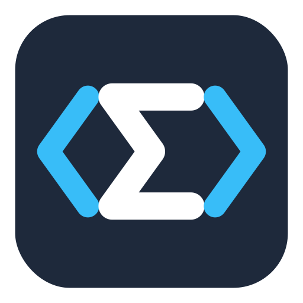

<p align="center">
  
</p>

<h1 align="center">Semorphe</h1>

<p align="center">
  <strong>唯一真實，各式投影。</strong><br>
  解構語法之散，重塑形態之模。
</p>

<p align="center">
  
  
  
</p>

---

**Semorphe**（散模費，σημορφή）是一套以語義樹為核心的程式教學工具，讓程式碼與積木之間能雙向即時轉換。

名稱由希臘文 σῆμα（語義）與 μορφή（形態）組合而成 — 一棵語義樹是唯一真實，積木與程式碼只是它的不同投影。

## 特色

- **雙向同步** — 修改積木即時更新程式碼，修改程式碼即時更新積木
- **語義樹驅動** — 以 Semantic Tree 為 Single Source of Truth，非簡單的文字↔積木映射
- **認知分級** — L0 初學 / L1 進階 / L2 完整，漸進式揭露 C++ 功能
- **多種程式碼風格** — APCS（cout/cin）、競賽（printf/scanf）、Google 風格一鍵切換
- **優雅降級** — 不支援的語法自動降級為原始碼積木，標註信心度
- **VSCode 延伸模組** — 直接在編輯器側邊欄使用積木面板

## 快速開始

```bash
# 安裝依賴
npm install

# 啟動開發伺服器
npm run dev

# 執行測試
npm test

# 建置
npm run build
```

## 架構

```
src/
├── core/           # 語義樹、投影引擎、block spec registry
├── languages/      # 語言模組（目前支援 C++）
├── interpreter/    # 語義樹直譯器
└── ui/             # Blockly 面板、Monaco 編輯器、同步控制器
```

核心原則：語義樹（Semantic Tree）是唯一的真實來源。積木（Blockly）和程式碼（Monaco）都是語義樹的投影。所有轉換都透過語義層進行，不直接在兩種視覺表示之間映射。

## VSCode 延伸模組

```bash
cd vscode-ext
npm install
node esbuild.mjs
# 按 F5 啟動 Extension Development Host
```

詳見 [vscode-ext/README.md](vscode-ext/README.md)。

## 授權

MIT
