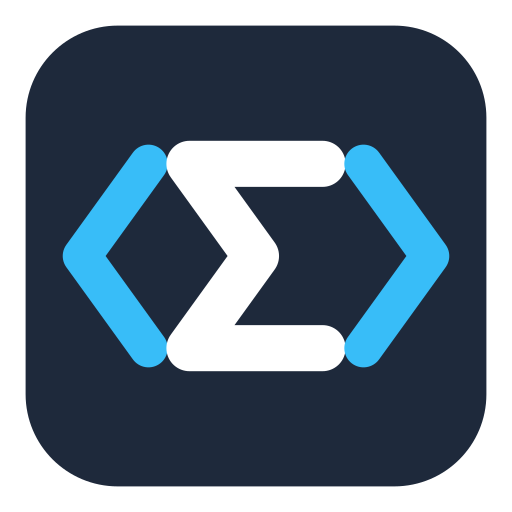

<p align="center">
  
</p>

<h1 align="center">Semorphe</h1>

<p align="center">
  <strong>同一支程式，三種看法——程式碼、流程圖、積木。改哪一邊都算數。</strong>
</p>

<p align="center">
  
  
  
</p>

---

把真的 C++ 或 Python 貼進去，它變成積木；拖一塊積木，程式碼跟著變；
切到流程圖，它畫的是同一支程式。**三邊都可以編輯，三邊即時同步。**

<p align="center">
  <b>▶ <a href="https://semorphe.com/">馬上試（不用安裝）</a></b>
</p>

<p align="center">
  
</p>

<p align="center"><sub>
  打一段 C++ → 三邊同時長出來 → <b>在程式碼、在積木、在流程各改一次</b>，另外兩邊當場跟著變 → 按執行，它真的會跑
</sub></p>

## 它跟別的積木工具差在哪

多數積木工具是**單向**的：積木能變成程式碼，而程式碼變不回積木。
少數做到雙向的（例如 MakeCode），走出它支援的子集就回不去。

Semorphe 想做的是另一件事：

| | |
|---|---|
| **三個畫面都能編輯** | 程式碼、流程圖、積木——不是「一個能改 ＋ 兩個唯讀」 |
| **吃的是真的程式碼** | 貼一段你手邊的 `.cpp` 或 `.py` 進去，不是玩具子集 |
| **接不住的時候它會說** | 認不出來的語法**不會被丟掉，也不會被猜**——它變成一顆灰色積木，原文一字不動地放在裡面 |

第三點聽起來不像賣點，而它是：**它保證這個工具不會安靜地弄壞你的檔案。**

<p align="center">
  
</p>

<p align="center"><sub>
  認不出來的 <code>goto</code> 變成一顆<b>寫著原文</b>的積木 → 在別的地方改一個數字 → <b>它一個字都沒動</b>
</sub></p>

## 還有這些

- **由淺入深** — 66 堂課、6 條軌道（C++ 入門／進階、C 銜接、Python 入門／銜接、Arduino 專題）。
  工具箱只給這一堂該有的積木
- **骨架看得到、拆不壞** — `#include`、`int main()` 這些「不是你寫的」那幾行，
  可以藏起來、可以淡淡地顯示（看得到而拖不動）、也可以整個交給學生
- **多種程式碼風格** — APCS（`cout`/`cin`）、競賽（`printf`/`scanf`）、Google、Python 一鍵切換
- **硬體** — 8 塊板子（Uno／Nano／ESP32 家族／D1 mini…），
  每塊板子有自己的腳位、常數與函式庫標頭
- **離線可用** — 跑起來之後**不會向外要任何東西**（有一條測試守著）
- **IDE 延伸模組** — VSCode 與 Arduino IDE 共用同一份

## 畫面怎麼排

三個投影各佔一欄，而**哪一格顯示哪一層由你決定**：

| | |
|---|---|
| **三張版面** | 專注（一次一個）／對照（程式碼 ＋ 積木）／三欄 |
| **每一格自己選** | 每一格的頭上有一顆下拉「這一格顯示」——選到別處的**就對調** |
| **主控台在底下** | 它不是投影，是**執行的輸出**——所以它是編輯區底下一條獨立、全寬、關得掉的底條（主控台／變數兩頁）|

<p align="center">
  
</p>

<p align="center"><sub>
  關掉主控台 → 按執行，<b>它自己回來</b> → 用「這一格顯示」把兩格<b>對調</b> → 切「對照」收成兩欄
</sub></p>

> 主控台關得掉，而**它一定回得來**：版面選單叫得回來，而程式一有輸出它自己就回來。

⚠️ 而 IDE 裡這幾件事**由 IDE 自己排**（分頁、分欄都是宿主的東西），
所以那裡的「版面」是一句**請求**，不是我們自己畫的格子——見下面〈IDE 延伸模組〉。

## ⚠️ 現在做不到什麼

寫在這裡，因為你遲早會撞到：

- **語言**只有 C++（含 C 方言）與 Python。加一個語言是一整刀，不是設定
- **認不出來的語法會降級成灰色積木**。它跑得動、來回轉換不會壞，但它在積木上就是一塊灰的
- **Arduino IDE 沒有自動更新**——它把擴充市集對使用者關掉了，只能手動放 `.vsix`
  （步驟見[安裝](#arduino-ide)，⚠️ 更新時有一個少了會安靜失敗的步驟）
- **流程圖是新的**（2026-08），它的編輯能力還在長
- **Arduino IDE 排不出等寬的三欄**——它沒有那顆指令（查證過），要手動拖分隔線

## 安裝

不想裝的話，[網頁版](https://semorphe.com/)就是完整的同一套東西——
以下只在你想「在自己的編輯器裡用」時才需要。

### VSCode

**方法一：市集**（會自動更新）

擴充商店搜 **Semorphe**，或直接開
[市集頁面](https://marketplace.visualstudio.com/items?itemName=timcsy.semorphe-vscode)。

**方法二：`.vsix` 檔**

到 [Releases](https://github.com/timcsy/semorphe/releases) 下載
`semorphe-vscode-<版本>.vsix`，然後任選一種：

```bash
code --install-extension semorphe-vscode-0.12.0.vsix
```

或在 VSCode 裡：命令面板（`Cmd/Ctrl` + `Shift` + `P`）→
**Extensions: Install from VSIX…** → 選那個檔。

⚠️ 這樣裝的**不會自動更新**，新版要再做一次。

### Arduino IDE

🔴 **Arduino IDE 沒有安裝擴充的介面**——它是 Theia 做的，而它把擴充市集
對使用者關掉了。所以只能把檔案放進去：

1. 到 [Releases](https://github.com/timcsy/semorphe/releases) 下載
   `semorphe-vscode-<版本>.vsix`
2. **完全關掉 Arduino IDE**
3. 把檔案放進這個資料夾（不存在就自己建）：

   | | |
   |---|---|
   | macOS / Linux | `~/.arduinoIDE/plugins/` |
   | Windows | `%USERPROFILE%\.arduinoIDE\plugins\` |

4. 重開 Arduino IDE——它會自己解壓——命令面板 → **Semorphe: 開啟積木面板**

**更新**：一樣的四步，而第 3 步**先把舊的 `semorphe-vscode-*.vsix` 刪掉**。
檔名帶版本是有意的：Theia 的解壓快取以名字為鍵，版本進到名字裡，
新舊就不會混。

> 🪦 這不是官方支援的安裝方式，**Arduino IDE 換一版就可能失效**。
> 如果哪天它不動了，[網頁版](https://semorphe.com/)是同一套東西。

## 從原始碼跑起來（開發者）

```bash
npm install
npm run dev          # 開發伺服器
npm test             # 單元／整合測試
npm run test:e2e     # Playwright
npm run build        # tsc + vite build
npm run build:vscode # 打包 IDE 延伸模組
npm run install:ide  # 裝進本機的 VSCode / Arduino IDE
```

## 架構

```
src/
├── core/         # 語義樹本身、兩個方向的轉換引擎、各語言登記自己資料的地方
├── components/   # 一顆「程式概念」一個資料夾（if、迴圈、印出來…）
├── languages/    # 每個語言一包：解析器、課程、目標板子、程式碼風格、工具箱分類
├── interpreter/  # 語義樹直譯器
├── ui/           # 三個面板（積木 / 流程圖 / 程式碼）與它們之間的同步
└── vscode/       # IDE 延伸模組（VSCode + Arduino IDE 共用）
```

### 為什麼三邊不會各說各話

```
程式碼 ──讀進來──→ 語義樹 ──寫回去──→ 程式碼
                     │
                     ├──→ 積木
                     └──→ 流程圖
```

**中間那棵樹是唯一的真相。** 三個畫面都從它算出來，也都改得動它，
**而沒有任何一條捷徑**——不會有「積木直接翻成程式碼」這種路。

那正是多數同類工具會漂掉的地方：兩邊各自維護一份翻譯，
改了一邊而另一邊沒跟上，久了就對不起來。

> 專案裡把那三個畫面叫做**投影**——一個投影是從真相**算出來**的，
> 所以它可以少（積木上看不到 `#include`），但**不會多出真相裡沒有的東西**。
>
> 兩句標語：**「唯一真實，各式投影。」**
> 教育情境的那句是「解構語法之散，重塑形態之模」。

### 一顆「元件」是什麼

一個程式概念（`if`、`while`、印出來、變數指派…）＝ 一個資料夾。
專案裡叫它**膠囊**，因為它把那個概念的每一面都裝在同一處：

```
src/components/python/loop_while/          ← Python 的 while 迴圈
  component.json        它叫什麼、有哪些欄位、可以接哪些子積木
  lift-pattern.json     怎麼從【程式碼】認出它
  generate.ts           怎麼把它寫回【程式碼】
  forms/blocks.json     它畫成【積木】長什麼樣（同一份也用來從積木讀回資料）
  execute.ts            執行它會發生什麼事
  labels/zh-TW.json     積木上的中文字（另有 en.json）
  spec.test.ts          它自己的測試
```

那五件事（**認出來 · 寫回去 · 畫出來 · 讀回來 · 執行**）就是一顆元件的全部——
少任何一件都要在 `component.json` 裡**寫明為什麼沒有**，
好讓「刻意不做」與「忘了做」分得出來。

🟢 **加一顆元件＝新增一個資料夾。** 系統自己會掃到它，
不需要去別的檔案登記——所以加東西不會弄壞既有的東西。

## AI 輔助的開發管線

Semorphe 把重複的開發流程寫成 **skill**——給 AI 助理看的操作手冊
（原始檔在 `knowledge/skills/`，用符號連結出現在 `.claude/skills/`）。

它們**不是模板，是這個專案的記憶**：裡面幾乎每一條規矩後面都有一次具體的翻車，
而那次翻車就寫在旁邊。

### 加一顆元件

```
/component-pipeline {lang} {target}
```

它串起六個階段：

| 階段 | Skill | 做什麼 |
|---|---|---|
| 1 | `component-discover` | 查這個函式庫／語法有哪些概念，該怎麼命名、放在第幾關 |
| 2 | `component-generate` | 產出上面那個資料夾裡的每一個檔 |
| 3 | `component-roundtrip` | 程式碼 → 積木 → 再變回程式碼，跑起來比對輸出 |
| 4 | `component-fuzz` | 出題的 AI **看不到實作**，只有這樣它才會問你不會問自己的問題 |
| 5 | `component-integrate` | 最終關卡：型別檢查、全套測試、來回轉換全部通過才算數 |
| 6 | `verify-in-browser` | 🔴 **打開瀏覽器【用眼睛看】**——前五關全綠而使用者一看就發現的缺陷 |

### 加一個**語言**

```
/add-language
```

⚠️ **與上面那條是不同的路**——上面那條假設語言**已經在了**。

從零加一個語言要處理的是另一批東西：接上解析器、
**讓系統知道每條辨識規則是寫給哪個語法的**（少了這一步，
新語言的 `if` 會被當成舊語言的 `if`，而且**不會有任何錯誤訊息**）、
以及四件「這個語言怎麼寫註解」「認不出來時用哪顆灰色積木」之類的登記。

### 其他

| Skill | 用途 |
|---|---|
| `component-refactor` | 檢查與修復既有的元件（它讀的是自動檢查產生的報表，不是自己重掃） |
| `component-rename` | 大規模改名（上千處引用）——**一定要附使用者舊存檔的轉換** |
| `build-guardrail` | 把一條「應該要這樣」的規矩，變成一支**做錯就會變紅**的測試 |
| `manual-acceptance` | 有些規矩測不起來（「按下去看到什麼」）——寫成一張人按得完的清單 |
| `diagnose-in-browser` | 已經知道有問題時，在瀏覽器裡查出是哪一段 |
| `ship-extension` | 把一次改動交到兩個 IDE 手上（這條流程跑了九次才被固定下來） |

完整清單與各自的緣起見 [`knowledge/skills/README.md`](knowledge/skills/README.md)。

## IDE 延伸模組

**已出貨**，VSCode 與 Arduino IDE（Theia 1.57）**共用同一份 `.vsix`**。

```
面板【就是】網頁版的 App，只是程式碼那一格換成宿主的編輯器
```

而 2026-09 之後它長成宿主原生的形狀：

| 這一層 | 住在哪 |
|---|---|
| 程式碼 | IDE 自己的編輯器 |
| 積木 · 流程 | **各自一個編輯器分頁**（`semorphe.openBlocks` / `openFlow`）|
| 主控台 · 變數 | **panel 區的兩個原生分頁**，與終端機／問題並排 |
| 控制項 | 狀態列（目標、課程、風格、版面…）＋ 標題列（▷ 執行、↩↪）|

三個宿主（網頁、VSCode、Arduino IDE）的版面清單**逐字相同**，因為三張版面
全是**純欄**——排它只需要「把這一格放到第幾欄」，而那是每個宿主都做得到的
最小動作。

> 🔴 上一版有一張「十字」（四格，主控台佔一格），而它是**唯一需要編輯區有
> 第二列**的版面——Theia 沒有 `setEditorLayout`，那一格排不出來。
> 拿掉它之後，三個宿主第一次是同一個形狀。
> 見 [`history/202`](knowledge/history/202-十字退場而主控台回到它本來的位置.md)。

### ⚠️ 兩個宿主真的不一樣的地方

都是**量出來**的（bundle 裡查證 ＋ 實測），而不是猜的：

| | VSCode | Arduino IDE |
|---|---|---|
| 三欄等寬 | ✅ 自動 | ❌ 它沒有「平均欄寬」那顆指令——要手動拖 |
| 「這一格改顯示程式碼」 | ✅ | ❌ 不列入選單（它關不掉多開的那個檔案分頁）|
| 面板現在開著沒有 | ✅ 答得出 | ❌ 答不出 → 選單改用中性的名字（不假裝知道）|

名單住在 `src/vscode/host-quirks.ts`，**每一筆都附病歷**，而且都有「實測會降級」
的第二層——⚠️ 其餘每一個檔都不准問「你是誰」（第六十三條護欄擋著）。

```bash
npm run build:vscode   # 產出 .vsix
npm run install:ide    # 裝進本機兩個 IDE
```

⚠️ **開發時不要自己複製 `.vsix`**——`install:ide` 會處理兩邊的快取失效
（Theia 以資料夾名字為鍵、VSCode 以 `(id, version)` 為鍵，兩個都是
「換了而不重載，且不報錯」）。使用者的手動步驟見[安裝](#arduino-ide)。

> 🪦 2026-03 的那個原型已於 2026-08-16 退休（教訓見
> [`knowledge/history/069`](knowledge/history/069-vscode原型退休而它的兩個教訓被撈出來.md)），
> 現在這一份是 2026-08 重做的。

## 給 AI agent 與貢獻者

這個 repo 把「為什麼」寫下來了，**而且它是權威的，不是裝飾**。動手之前依序讀：

1. [`CLAUDE.md`](CLAUDE.md) — 什麼時候跑什麼測試（⚠️ 那張表有一列是紅字的，別跳過）
2. [`knowledge/principles.md`](knowledge/principles.md) — 不可協商的那幾條
3. [`knowledge/vision.md`](knowledge/vision.md) — 下一步在哪
4. [`knowledge/experience.md`](knowledge/experience.md) — 前人踩過的坑（找與你這一刀相關的）

三件會讓一次改動被擋下來的事：

- **改了規範而沒有機械化的檢查** — 見 `knowledge/skills/build-guardrail`。
  這個專案有 **99 條護欄**（數字由 `tests/integration/audit-guardrail-count.test.ts`
  算出來，而它會擋住這一行變成過期的數字），而它們的存在理由是同一句：
  *一條規範沒有機械化的檢查，它本身就是殼——而殼看起來像完成。*
- **改了使用者按得到的東西而沒跑 `npm run test:e2e`** — 全套單元測試綠**擋不住**它
- **把同一個決定實作第二次** — 這裡發生過六次，見
  [`history/188`](knowledge/history/188-Arduino要腳手架而它逼出了「哪一塊是外框」的第六份實作.md)

⚠️ 而 `knowledge/skills/` 裡有 **19 支學過的流程**（加語言、生課程、退場一顆積木…）。
**你要做的事如果在裡面，照著走，不要重想**——每一條規矩後面都有一次具體的翻車。

## 專案知識庫

這個專案的 **why** 記在 [`knowledge/`](knowledge/)，而不是散在 commit 訊息裡：

| | |
|---|---|
| [`principles.md`](knowledge/principles.md) | 根公理與衍生原則——不可協商的那些 |
| [`vision.md`](knowledge/vision.md) | 定位與**還活著的**路線圖（完成的收斂成一行 ＋ 指標） |
| [`experience.md`](knowledge/experience.md) | 從翻車裡蒸餾出來的教訓 |
| `concepts/` | 反覆出現的概念，各自一篇 |
| `history/` | 「為什麼變成現在這樣」的因果紀錄——每次改變都留一筆 |
| `episodes/` | 值得重看的完整除錯現場 |
| `draft/` | 還沒定案的想法（沒有被用到就會自然淡掉） |

⚠️ **接手任何工作之前先讀那三個檔**——這個專案的多數規矩都有一次具體的災難在後面，
而**那個災難不在程式碼裡**。

## 授權

MIT
