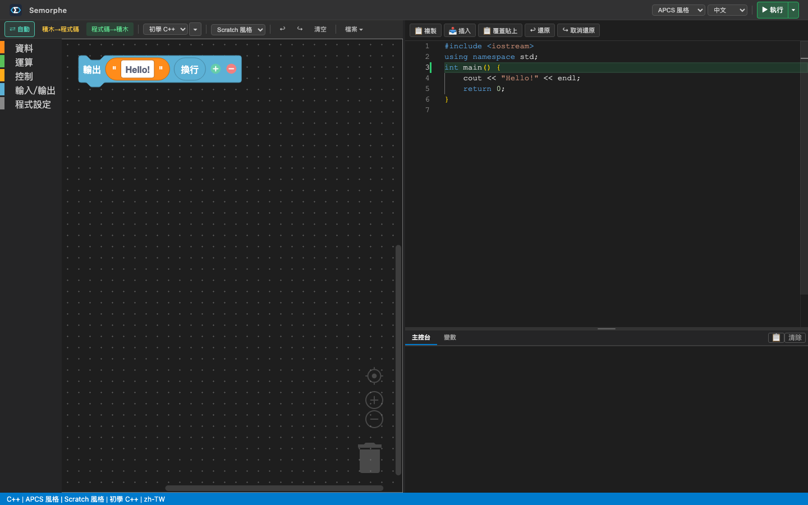
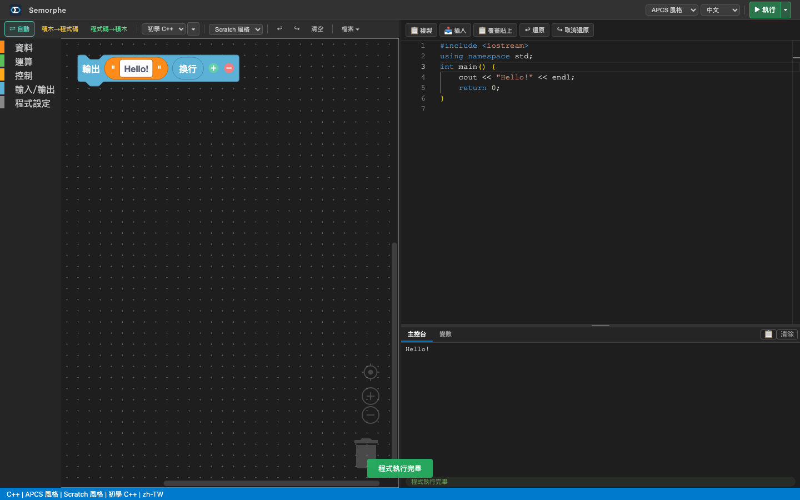

# 第一課：印出一句話

> 這一課大約 10 分鐘。走完之後，你會有一個**真的會跑**的程式。

## 你會學到三件事

```
main       每個 C++ 程式的起點
印出       把東西顯示在畫面上
文字       用引號包起來的一段字
```

⚠️ **只有三件。** 這一課刻意不教變數、不教迴圈——那些下一課再說。

---

## 開始之前

打開系統，你會看到**兩個並排的區域**：

```
左邊   積木        用拖的
右邊   程式碼      用打字的
```

🔴 **它們是同一個程式的兩種樣子。** 動其中一邊，另一邊會跟著變——
這是這個系統最重要的一件事，而你等一下會親眼看到。

---

## 第一步：把程式的骨架打上去

C++ 的程式都從一個叫 **`main`** 的地方開始跑。沒有它，電腦不知道要從哪裡讀起。

**在程式碼那一側，打上這段：**

```cpp
int main() {
    return 0;
}
```

⚠️ **這一段先照抄就好。** `main` 是每個程式都長一樣的骨架——
你之後會天天寫它，而現在不需要懂它為什麼長這樣。

---

## 第二步：印出一句話

在 `return 0;` 的**上面**加一行：

```cpp
cout << "Hello!" << endl;
```

完整長這樣：

```cpp
int main() {
    cout << "Hello!" << endl;
    return 0;
}
```

現在按「**程式碼→積木**」。

👀 **看左邊**——出現了三塊積木。你打的那一行變成了可以拖的東西。



> 這就是「同一個程式的兩種樣子」。
>
> ⚠️ 而你會發現 `main` 那一行**沒有變成積木**——
> 積木這一側只放**做事情的那些行**，骨架不放。

<!-- ⚠️ 上面那張圖是【自動產生】的（e2e/lesson-01.spec.ts 每次跑都重截），
     所以它不會隨介面改版而過時。代價是它長得像測試環境，不是精心構圖。
     真的需要構圖的圖，單獨手畫並標明「示意圖，不是實際畫面」。 -->

**三個部分**：

| 你寫的 | 意思 |
|---|---|
| `cout <<` | 把後面的東西**印出來** |
| `"Hello!"` | 一段**文字**——⚠️ 引號是必要的，它告訴電腦「這是字，不是指令」 |
| `<< endl` | **換行**（end line） |

⚠️ 而**行尾的分號**不能少。它是 C++ 的句號。

再按一次「**程式碼→積木**」，看看積木變成什麼樣子。

---

## 第三步：跑跑看

按上方的「**▶ 執行**」。

👀 **看畫面下方**——輸出會出現在那裡：

```
Hello!
```



🎉 **你的第一個程式跑起來了。**

---

## 換你了

把 `Hello!` 換成**你自己的名字**，再跑一次。

⚠️ 記得引號要留著。

---

## 這一課你做了什麼

```
① 寫了一個 main —— 程式的起點
② 用 cout << 印出一段文字
③ 看到同一個程式的【兩種樣子】
```

**下一課**：讓程式記住東西（變數）。

---

## 如果卡住了

| 症狀 | 大概是什麼 |
|---|---|
| 按執行沒反應 | 看看程式碼那一側有沒有**紅色的波浪**——那代表有地方寫錯了 |
| 說「還不能執行」 | 通常是**少了分號**，或**括號沒有成對** |
| 積木沒有出現 | 要按「程式碼→積木」才會同步 |
